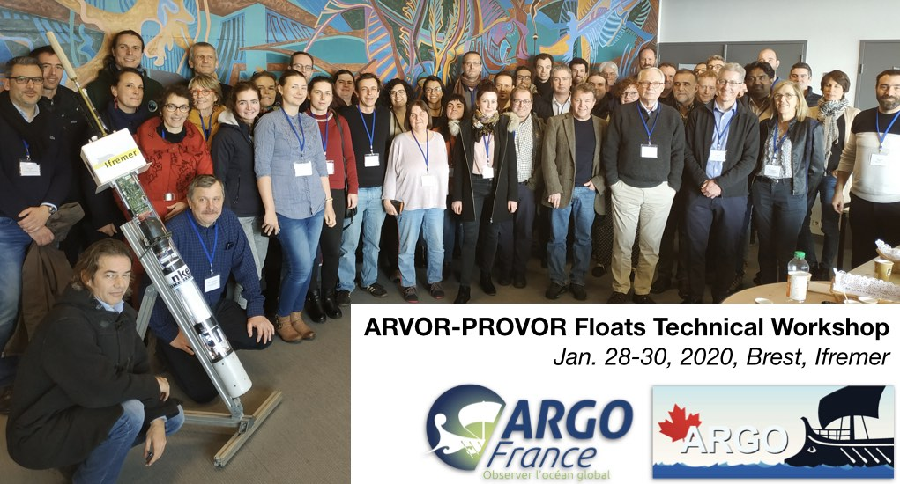

# 2020 Arvor/Provor Argo floats technical workshop

Held in Brest in January 2020, this workshop organised by Argo-France and Argo-Canada with the help of Euro-Argo aimed 
to provide Arvor-Provor Argo float users with extensive technical information and to share best practices. 

