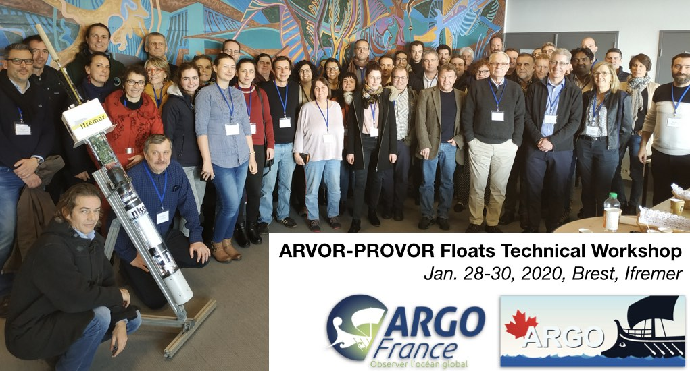

# 2020 Arvor/Provor floats technical workshop

## Aims of the workshop
The aim of this workshop was to provide Arvor-Provor Argo float users with extensive technical information and to share best practices. The workshop is being organized by Argo-Canada and Argo-France and will take place at Ifremer in Brest, France on 28 to 30 January 2020.

At the end of the meeting, the attendees should:
- Understand the Arvor-Provor float technology and the different existing float types;
- Have information on the planned upgrades and be able to provide insight on their priorities;
- Have an overview of some ongoing projects using Arvor & Provor profiling floats;
- Understand the suggested pre-deployment procedures and how a float can be deployed, thanks to the hands-on at the test pool;
- Understand the mandatory information needed for a float to be registered at JCOMMOPS and processed by a DAC;
- Have better knowledge of the tools provided at JCOMMOPS, Coriolis GDAC and DAC.

*Organizing Committee*
The workshop conveners include the following people:

- Noé POFFA (Ifremer, France)
- Blair GREENAN (DFO-MPO, Canada)
- Antoine POTEAU (LOV, France)
- Guillaume MAZE (Ifremer, France)

